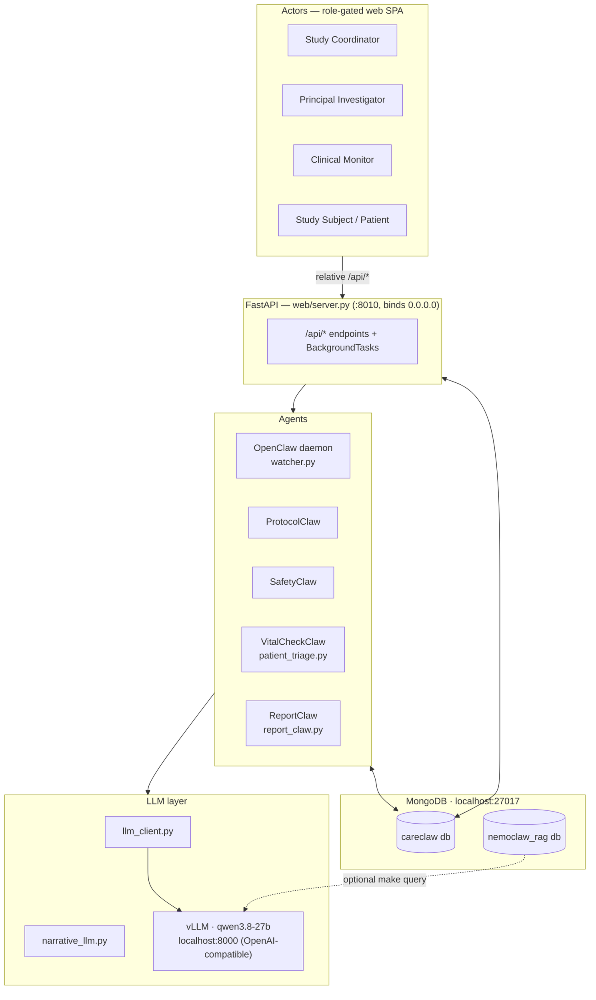

# CareClaw — Architecture

On-prem clinical-trial safety copilot. Clinical data (staff intake **or** patient
ePRO) is reviewed by deterministic agents, the regulatory narrative is drafted by
a **local LLM**, and a physician reviews, iterates, and 1-click signs a **21 CFR
Part 11** audit lock. **MongoDB is the single source of truth; nothing leaves the box.**

---

## 1. Layers



- **Frontend** — one static SPA (`web/static/{index.html,app.js,styles.css}`) served
  by FastAPI (same-origin). All calls are **relative `/api/*`**, so it works over the
  LAN with no per-client config. Four roles gate nav + actions (see `[DATA_MODEL.md]`).
- **API / orchestration** — `web/server.py` (FastAPI). Synchronous endpoints for
  reads/writes; **`BackgroundTasks`** run the slow LLM work off the request path.
- **Agents** — deterministic compliance core + LLM prose (below).
- **LLM layer** — a thin OpenAI-compatible client to the on-box vLLM.
- **Data plane** — MongoDB (below), the source of truth.

---

## 2. Agents

| Agent | File | Kind | Does | Emits |
| --- | --- | --- | --- | --- |
| **OpenClaw** | `daemon/watcher.py` | deterministic | Intake pipeline (`_enqueue_case`): pairs note+labs, runs ProtocolClaw+SafetyClaw, enqueues the case. Shared by the daemon **and** the web intake endpoints. | `CASE_ENQUEUED` |
| **ProtocolClaw** | `agents/protocol_claw.py` | deterministic (YAML) | Visit-window + prohibited con-med deviations, with protocol citations. | — |
| **SafetyClaw** | `agents/safety_claw.py` | deterministic | CTCAE v5 grading, MedDRA mapping, deterministic 3500A zero-draft, **SHA-256 Part 11** audit record. | — |
| **VitalCheckClaw** | `web/patient_triage.py` | deterministic + LLM summary | Grades patient ePRO vitals/symptoms vs study thresholds; LLM writes the concern summary. | `PATIENT_VITAL_ALERT` |
| **ReportClaw** | `web/report_claw.py` | **LLM** (async) | On a vital alert, drafts the 3500A with Qwen and enqueues a PI-review case. | `REPORT_GENERATED` |
| **Narrative upgrade** | `web/server.py` (`_run_intake_llm_upgrade_bg`) | **LLM** (async) | After a fast deterministic intake, rewrites the 3500A prose with Qwen. | `NARRATIVE_UPGRADED` |

**Design rule:** *findings/grades/citations are deterministic (GAMP-5 reproducibility);
the LLM only writes prose and summaries, and never decides causality.*

---

## 3. Event-driven flow

```
STAFF INTAKE (upload note+labs)                 PATIENT ePRO (vitals/symptoms)
   OpenClaw → ProtocolClaw + SafetyClaw            VitalCheckClaw (deterministic)
   → case NEEDS_PI_REVIEW  [CASE_ENQUEUED]         → [PATIENT_VITAL_ALERT]
   ↳ BackgroundTask: Qwen upgrades narrative       ↳ BackgroundTask: ReportClaw (Qwen)
     [NARRATIVE_UPGRADED]                            → case NEEDS_PI_REVIEW [REPORT_GENERATED]
                         \                          /
                          ▼                        ▼
                     PI Review Inbox  → chat-iterate (Qwen) → Approve & Sign
                          → status SIGNED  [CASE_SIGNED + SHA-256 Part 11 lock]
```

Both entry points return in **milliseconds**; the ~75–120s reasoning-model work runs
in a `BackgroundTask`, so nothing blocks the UI. The generated/updated case appears
in the PI inbox on its normal auto-poll. Every hop is written to MongoDB and is
re-readable as LLM context.

---

## 4. Tech stack & how it interacts

| Component | Tech | Talks to | How |
| --- | --- | --- | --- |
| Frontend | vanilla HTML/CSS/JS SPA | FastAPI | relative `fetch("/api/...")`, same-origin |
| Backend | **FastAPI** + Uvicorn (`web/server.py`) | MongoDB, vLLM | `CareClawStore` (pymongo) for data; `llm_client` (httpx) for the model |
| Data | **MongoDB 7** (`localhost:27017`) | — | `store/careclaw_store.py`; see `[DATA_MODEL.md]` |
| Model | **vLLM** serving **Qwen3.8-27B** (Docker, `localhost:8000`) | — | OpenAI-compatible `/v1/chat/completions`; tuned per `[VLLM_INTEGRATION.md]` (`reasoning_effort: low/medium`, single system message, temp floor, 8k tokens) |
| RAG (optional) | MongoDB `$text` index over the protocol corpus | vLLM (optional) | `rag/*`, `make query`; **not wired into the live pipeline** |

Data path: **SPA → FastAPI → MongoDB** (all persistence). Model path: **FastAPI →
`llm_client` → vLLM** (prose/summaries only). vLLM and MongoDB both stay on
`localhost` → **no cloud egress**.

---

## 5. Harness / runtime

**Services (all on the GB10 box):**

| Service | Port | Start |
| --- | --- | --- |
| MongoDB | 27017 (localhost only) | `make mongo-up` |
| vLLM (Qwen) | 8000 | `docker start vllm-qwen` (~4 min to ready) |
| Web console | 8010 (LAN, `0.0.0.0`) | `make web` |

**Run order:**
```bash
make mongo-up      # database up
make seed          # load PT-004 case, care-team, roster, ePRO reports  (resets careclaw db)
make web           # FastAPI console → http://<LAN-IP>:8010   (make where prints the URL)
```

**Key env flags** (all optional; sensible defaults):

| Var | Default | Effect |
| --- | --- | --- |
| `WEB_HOST` / `WEB_PORT` | `0.0.0.0` / `8010` | web bind (`WEB_HOST=127.0.0.1` = localhost-only) |
| `CARECLAW_DB` | `careclaw` | operational DB name (tests use a throwaway) |
| `VLLM_BASE_URL` / `VLLM_MODEL` | `http://localhost:8000/v1` / auto | model endpoint |
| `VLLM_REASONING_EFFORT` | `low` | thinking effort (`low`/`medium`/`xhigh`/`off`) |
| `VLLM_ENABLED` | `1` | `0` → all LLM calls fail soft to deterministic |
| `INTAKE_LLM_UPGRADE` | `1` | `0` → intake stays deterministic, no async upgrade |
| `REPORTCLAW_ENABLED` | `1` | `0` → vital alerts don't auto-draft a report |

**Fail-soft:** every LLM call is wrapped; if vLLM is down or slow, the deterministic
draft/summary stands and the demo never crashes. See `[NETWORK_ACCESS.md]` for LAN/no-auth notes.

---

## 6. Scaffold — real vs. narrative

| Name | Reality |
| --- | --- |
| OpenClaw / ProtocolClaw / SafetyClaw / VitalCheckClaw / ReportClaw | ✅ implemented |
| Qwen vLLM narrative + chat + summaries | ✅ live |
| 21 CFR Part 11 SHA-256 lock, append-only `events` | ✅ real |
| MongoDB single source of truth | ✅ real (`careclaw` db) |
| Mongo Protocol RAG | ✅ works via `make query`; **not on the live path** |
| Hermes | ⚠️ named in pitch as an alt agent framework; **not used** (we call Qwen directly) |
| OpenShell / NemoClaw | ⚠️ policy YAML + scaffold; full sandbox aspirational |
